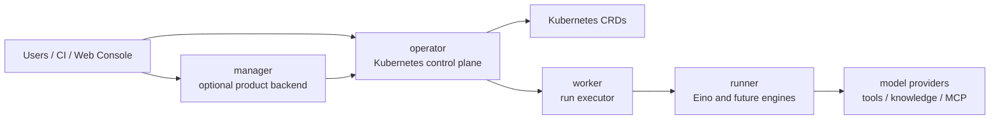

<p align="center">
  
</p>

<p align="center">
  <strong>Enterprise multi-tenant Agent Control Plane on Kubernetes.</strong>
</p>

<p align="center">
  <a href="./README.zh-CN.md">中文</a>
  ·
  <a href="./docs/architecture/component-boundaries.md">Architecture</a>
  ·
  <a href="./docs/phase2/eino-runtime-design.md">Runtime Design</a>
  ·
  <a href="./web/README.md">Web Console</a>
</p>

<p align="center">
  
  
  
  
</p>

# Korus

Korus is a Kubernetes-native platform for declaring, evaluating, publishing,
governing, and running AI agents.

It is designed as an **enterprise Agent Control Plane**, not just an agent
runtime. The long-term product shape combines a Kubernetes operator, an
optional database-backed manager service, worker-based execution, pluggable
runners, and a visual Web Console for agent orchestration, evaluation, release,
and governance.

> Korus is in active alpha development. The Kubernetes API group is currently
> `windosx.com/v1alpha1`; the source repository is
> `github.com/surefire-ai/korus`.

## Why Korus

Most agent systems start as SDK code, workflow scripts, or hidden application
logic. That works for prototypes, but enterprise teams quickly need stronger
contracts:

- multi-tenant workspace boundaries
- provider and credential governance
- auditable agent revisions and run records
- evaluation gates before release
- visual composition for product teams
- Kubernetes-native deployment and operations

Korus makes those concerns part of the platform contract.

## Core Capabilities

| Capability | What Korus provides |
| --- | --- |
| Declarative agents | CRDs for `Agent`, `AgentRun`, `PromptTemplate`, `ToolProvider`, `KnowledgeBase`, `MCPServer`, `Skill`, `Dataset`, `AgentPolicy`, and `AgentEvaluation`. |
| Deterministic compilation | A compiler validates references, expands supported patterns, and records compiled artifacts and revisions on status. |
| Runtime dispatch | `AgentRun` resources can execute through a mock backend or a Kubernetes Job worker backend. |
| Model credentials | Agents reference Kubernetes Secrets; secret values are not written into status, artifacts, or logs. |
| Provider strategy | The compiler validates model providers against a catalog and currently routes OpenAI-compatible providers through the shared chat path. |
| Evaluation first | `AgentEvaluation` and `Dataset` support reusable samples, expected values, baseline comparison, metrics, and threshold gates. |
| Enterprise scope | `Tenant` and `Workspace` CRDs act as lightweight runtime-scope bridge resources while the future manager owns product state in a database. |
| Web Console direction | The `web/` scaffold is the start of a UX-first console for visual orchestration, evaluations, releases, providers, and governance. |
| Agent patterns | Six built-in orchestration patterns — `react`, `router`, `reflection`, `tool_calling`, `plan_execute`, and `workflow` — so users can declare common agent designs without hand-writing a full graph. |
| SubAgent composition | Agents can reference other Agents as SubAgents with cycle detection, async invocation through the gateway, and result propagation. |
| Eino runtime | Workers execute compiled artifacts through Eino graphs with real LLM calls, tool invocation, and streaming support. |
| Manager API | Full CRUD REST API for tenants, workspaces, agents, evaluations, providers, and runs with PostgreSQL-backed storage and pagination. |
| CRD sync | Best-effort sync layer that pushes Manager database state to Kubernetes CRDs (Tenant, Workspace, Agent, AgentEvaluation, ToolProvider) via controller-runtime. |

## Architecture

Korus is moving toward four explicit components:



- **operator** reconciles CRDs, compiles agents, publishes status, enforces
  runtime contracts, and dispatches runs.
- **manager** is an optional product backend for tenants, workspaces, users,
  teams, release workflows, durable audits, and UI drafts.
- **worker** executes individual runs from compiled artifacts and runtime input.
- **runner** is the pluggable agent execution boundary. The default direction is
  `runtime.engine=eino` with `runtime.runnerClass=adk`.

Read more in
[component-boundaries.md](./docs/architecture/component-boundaries.md),
[manager-data-model.md](./docs/architecture/manager-data-model.md), and
[manager-operator-sync.md](./docs/architecture/manager-operator-sync.md).

## Quick Start

### Prerequisites

- Go
- Docker or a compatible container runtime
- Kubernetes cluster or local Kubernetes, such as OrbStack
- `kubectl`
- `make`

Optional:

- Helm, for chart validation and installs
- Node.js, for the Web Console scaffold

### Run Tests

```bash
make test
```

### Build Binaries

```bash
make build
```

### Generate Kubernetes Manifests

```bash
make generate manifests
```

### Deploy the Control Plane

```bash
make deploy
```

### Install with Helm

```bash
helm upgrade --install korus charts/korus \
  --namespace korus-system \
  --create-namespace
```

The chart is currently a development install path and will be promoted into the
official installation artifact as the project approaches a stable release.

## Try the EHS Sample

The canonical sample is an EHS hazard-identification agent under
[`config/samples/ehs`](./config/samples/ehs).

For a fast local validation path without a real model credential, use the
OrbStack smoke overlay:

```bash
make k8s-smoke-ehs
```

This target applies the sample resources, creates a dummy model credential,
deploys a mock OpenAI-compatible service, runs a fixed `AgentRun`, and prints
the final `AgentRun.status.output`.

To test against a real OpenAI-compatible endpoint:

```bash
kubectl create namespace ehs --dry-run=client -o yaml | kubectl apply -f -
kubectl apply -k config/samples/ehs
cp config/samples/ehs/openai-credentials.example.yaml /tmp/openai-credentials.yaml
```

Edit `/tmp/openai-credentials.yaml`, replace the placeholder API key, and then
apply it:

```bash
kubectl apply -f /tmp/openai-credentials.yaml
```

Do not apply `config/samples/ehs` with `-f`; use `-k` so the example Secret
template stays out of the default sample install.

## Invoke an Agent

The controller-manager exposes an invoke gateway at:

```text
POST /apis/windosx.com/v1alpha1/namespaces/{namespace}/agents/{agent}:invoke
```

Example request:

```bash
curl -sS -X POST \
  http://127.0.0.1:8082/apis/windosx.com/v1alpha1/namespaces/ehs/agents/ehs-hazard-identification-agent:invoke \
  -H 'Content-Type: application/json' \
  -d '{"input":{"task":"identify_hazard","payload":{"text":"巡检发现配电箱门打开，现场地面有积水。"}},"execution":{"mode":"sync"}}'
```

The gateway returns an accepted `AgentRun` name. The controller then dispatches
the run through the configured runtime backend.

## Runtime Backends

The controller-manager accepts `--runtime-backend`:

- `mock`: deterministic backend for control-plane validation.
- `worker`: creates a Kubernetes Job and runs `cmd/worker` with the compiled
  artifact, run input, and secret-backed model configuration.

The worker executes compiled artifacts through Eino-based runners. Six
orchestration patterns are supported: `react` (reasoning loop), `router`
(classify and route), `reflection` (generate-critique-revise), `tool_calling`
(model-driven structured tool calls), `plan_execute` (planner creates steps,
executor completes them), and `workflow` (deterministic DAG execution). Each
pattern maps to an Eino graph with real LLM calls and tool invocation.

## Web Console

The Web Console scaffold lives in [`web/`](./web).

It is intended to become the primary enterprise product surface for:

- tenant and workspace navigation
- visual agent orchestration
- run debugging
- evaluation comparison
- release gates
- provider management
- policy and governance workflows

Run the console against the fake manager API:

```bash
cd web
npm install
npm run dev:fake
```

See [`web/README.md`](./web/README.md) for current scope and development notes.

## Roadmap

| Phase | Focus | Status |
| --- | --- | --- |
| Phase 1 | Kubernetes-native MVP with CRDs, compilation, gateway invocation, worker Jobs, GHCR images, and Helm skeleton. | First public development baseline is in place. |
| Phase 2 | Real Eino runtime, provider catalog, model credential flow, policy checks, patterns, durable run artifacts, and stronger evaluation contracts. | **Complete.** |
| Phase 3 | Manager-backed enterprise product surface with Web Console, tenants, workspaces, visual orchestration, release workflows, evaluation UX, and provider management. | In progress. Manager API CRUD and CRD sync layer complete; Web Console and evaluation UX next. |
| Phase 4 | Distributed agent fabric with multi-runtime execution, autoscaling, SubAgent composition, and A2A interoperability. | Planned. |

Detailed design notes:

- [Phase 2 Eino Runtime Design](./docs/phase2/eino-runtime-design.md)
- [Agent Patterns, SubAgent, and A2A TODOs](./docs/phase2/agent-patterns-and-a2a-todo.md)
- [Console Information Architecture](./docs/phase3/console-information-architecture.md)
- [Tenancy and Workspace Model](./docs/phase3/tenancy-workspace-model.md)
- [v0.1.0 Release Notes](./docs/releases/v0.1.0.md)
- [v0.1.0 Readiness Checklist](./docs/releases/v0.1.0-readiness.md)

## Repository Layout

```text
api/v1alpha1/                  Kubernetes API types
cmd/controller-manager/         operator entrypoint
cmd/manager/                    optional product backend entrypoint
cmd/worker/                     worker entrypoint
config/crd/                     generated CRD manifests
config/default/                 Kustomize deployment entrypoint
config/samples/ehs/             canonical EHS sample
docs/architecture/              architecture and component boundaries
docs/phase2/                    runtime and agent semantics design
docs/phase3/                    console, tenancy, and product UX design
internal/compiler/              agent compiler and validation
internal/controller/            Kubernetes reconcilers
internal/gateway/               invoke gateway
internal/manager/               manager backend scaffold
internal/runtime/               runtime backend abstraction
internal/worker/                worker and runner boundary
web/                            future Web Console
```

## Development Commands

```bash
make test              # run Go tests
make ci              # run full CI checks (fmt, tidy, vet, test, build)
make fmt             # auto-format Go code
make vet             # static analysis
make build             # build controller-manager and worker
make generate          # generate deepcopy code
make manifests         # generate CRD manifests
make docker-build      # build container images
make helm-lint         # lint the development chart
make helm-template     # render the development chart
make k8s-smoke-ehs     # run the local EHS Kubernetes smoke test
```

## Project Status

Korus is currently suitable for platform design, local experimentation, CRD
contract work, compiler/runtime development, and early Kubernetes smoke tests.
It is not yet a stable production release.

Known alpha limits:

- the Eino runners cover six patterns with durable artifact storage and 8 evaluation metrics, but advanced features (streaming, parallel tool calls) are still evolving;
- the Helm chart is not yet packaged for distribution;
- gateway authentication, authorization, rate limiting, and idempotency are not
  complete;
- cancellation, retry, timeout, and durable run artifact storage are not
  complete;
- the Web Console is a scaffold; the Manager backend has full CRUD API and CRD sync but no UI yet;
- Helm is still a development install path.

## Contributing

Korus is early, so the most useful contributions are focused and contract-aware:

- CRD and compiler improvements
- runtime and worker tests
- provider capability modeling
- evaluation semantics
- local Kubernetes smoke coverage
- Web Console product flows that preserve the operator/manager boundary

Read [`CONTRIBUTING.md`](./CONTRIBUTING.md) for the full contribution guide.

Before opening a change, run:

```bash
make ci
git diff --check
```

If you change API types, also run:

```bash
make generate manifests
```

AI collaborators should read [`AGENTS.md`](./AGENTS.md) before making changes.

## License

Korus is licensed under the Apache License, Version 2.0. See
[`LICENSE`](./LICENSE).

This project depends on third-party Go modules under their own open source
licenses. Preserve [`NOTICE`](./NOTICE) and follow
[`THIRD_PARTY_NOTICES.md`](./THIRD_PARTY_NOTICES.md) when distributing source
archives, binaries, or container images.
