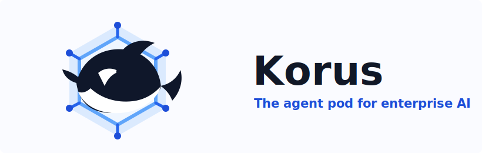
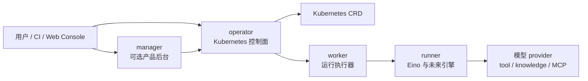

<p align="center">
  
</p>

<p align="center">
  <strong>基于 Kubernetes 的企业级多租户 Korus。</strong>
</p>

<p align="center">
  <a href="./README.md">English</a>
  ·
  <a href="./docs/architecture/component-boundaries.md">架构</a>
  ·
  <a href="./docs/phase2/eino-runtime-design.md">Runtime 设计</a>
  ·
  <a href="./web/README.md">Web Console</a>
</p>

<p align="center">
  
  
  
  
</p>

# Korus

Korus 是一个 Kubernetes 原生平台，用于声明、评测、发布、治理和运行 AI
Agent。

它的定位是 **企业级 Agent Control Plane**，而不仅仅是一个 Agent runtime。
长期产品形态会组合 Kubernetes operator、可选的数据库型 manager 服务、
worker 执行层、可插拔 runner，以及用于 Agent 可视化编排、评测、发布和治理的
Web Console。

> Korus 当前处于 alpha 阶段。Kubernetes API group 暂为
> `windosx.com/v1alpha1`；源码仓库为 `github.com/surefire-ai/korus`。

## 为什么需要 Korus

很多 Agent 系统一开始都是 SDK 代码、工作流脚本，或者藏在业务应用里的内部逻辑。
这对原型足够，但企业团队很快会需要更强的产品和平台契约：

- 多租户 workspace 边界
- 模型 provider 与凭据治理
- 可审计的 Agent revision 和运行记录
- 发布前 evaluation gate
- 面向产品团队的可视化编排
- Kubernetes 原生部署和运维

Korus 把这些能力变成平台契约的一部分。

## 核心能力

| 能力 | Korus 提供什么 |
| --- | --- |
| 声明式 Agent | `Agent`、`AgentRun`、`PromptTemplate`、`ToolProvider`、`KnowledgeBase`、`MCPServer`、`Skill`、`Dataset`、`AgentPolicy` 和 `AgentEvaluation` 等 CRD。 |
| 确定性编译 | compiler 会校验引用、展开已支持的 pattern，并在 status 中记录 compiled artifact 与 revision。 |
| Runtime 分发 | `AgentRun` 可以通过 mock backend 或 Kubernetes Job worker backend 执行。 |
| 模型凭据 | Agent 通过 Kubernetes Secret 引用凭据；secret 明文不会写入 status、artifact 或日志。 |
| Provider 策略 | compiler 会基于 provider catalog 校验模型 provider，并把 OpenAI-compatible provider 路由到共享 chat path。 |
| Evaluation 优先 | `AgentEvaluation` 和 `Dataset` 支持可复用样本、expected value、baseline 对比、metric 和 threshold gate。 |
| 企业级范围 | `Tenant` 和 `Workspace` CRD 当前是轻量 runtime-scope bridge，未来 canonical 产品状态由 manager 数据库持有。 |
| Web Console 方向 | `web/` 是 UX-first console 的起点，面向可视化编排、evaluation、release、provider 和治理体验。 |
| Agent pattern | 六种内置编排模式 — `react`、`router`、`reflection`、`tool_calling`、`plan_execute`、`workflow`，用户无需手写完整 graph 即可声明常见 Agent 设计。 |
| SubAgent 组合 | Agent 可引用其他 Agent 作为 SubAgent，支持环路检测、gateway 异步调用和结果传播。 |
| Eino runtime | Worker 通过 Eino graph 执行 compiled artifact，支持真实 LLM 调用、tool 调用和流式输出。 |
| Manager API | 面向 tenant、workspace、agent、evaluation、provider 和 run 的完整 CRUD REST API，PostgreSQL 存储 + 分页。 |
| CRD 同步 | best-effort 同步层，通过 controller-runtime 将 Manager 数据库状态推送到 K8s CRD（Tenant、Workspace、Agent、AgentEvaluation、ToolProvider）。 |

## 架构

Korus 正在朝四个明确组件演进：



- **operator** 负责 reconcile CRD、编译 Agent、发布 status、执行 runtime
  contract，并分发运行。
- **manager** 是可选产品后台，负责租户、workspace、用户、团队、发布流程、
  持久审计和 UI draft。
- **worker** 基于 compiled artifact 和 runtime input 执行单次运行。
- **runner** 是可插拔 Agent 执行边界。默认方向是 `runtime.engine=eino`
  与 `runtime.runnerClass=adk`。

更多设计见
[component-boundaries.md](./docs/architecture/component-boundaries.md)、
[manager-data-model.md](./docs/architecture/manager-data-model.md) 和
[manager-operator-sync.md](./docs/architecture/manager-operator-sync.md)。

## 快速开始

### 前置要求

- Go
- Docker 或兼容容器运行时
- Kubernetes 集群或本地 Kubernetes，例如 OrbStack
- `kubectl`
- `make`

可选：

- Helm，用于 chart 校验和安装
- Node.js，用于 Web Console scaffold

### 运行测试

```bash
make test
```

### 构建二进制

```bash
make build
```

### 生成 Kubernetes 清单

```bash
make generate manifests
```

### 部署控制面

```bash
make deploy
```

### 使用 Helm 安装

```bash
helm upgrade --install korus charts/korus \
  --namespace korus-system \
  --create-namespace
```

当前 chart 仍是开发安装路径，后续会随着稳定版本推进为正式安装 artifact。

## 体验 EHS 样例

标准样例是 [`config/samples/ehs`](./config/samples/ehs) 下的 EHS 危害识别
Agent。

如果只想在本地快速验证，不需要真实模型凭据，可以使用 OrbStack smoke overlay：

```bash
make k8s-smoke-ehs
```

这个 target 会应用样例资源、创建 dummy 模型凭据、部署一个 mock
OpenAI-compatible 服务、运行固定的 `AgentRun`，并打印最终
`AgentRun.status.output`。

如果要接入真实 OpenAI-compatible endpoint：

```bash
kubectl create namespace ehs --dry-run=client -o yaml | kubectl apply -f -
kubectl apply -k config/samples/ehs
cp config/samples/ehs/openai-credentials.example.yaml /tmp/openai-credentials.yaml
```

编辑 `/tmp/openai-credentials.yaml`，替换占位 API key，然后应用：

```bash
kubectl apply -f /tmp/openai-credentials.yaml
```

不要用 `-f` 直接应用 `config/samples/ehs`；请使用 `-k`，这样 example Secret
模板不会进入默认样例安装。

## 调用 Agent

controller-manager 暴露 invoke gateway：

```text
POST /apis/windosx.com/v1alpha1/namespaces/{namespace}/agents/{agent}:invoke
```

请求示例：

```bash
curl -sS -X POST \
  http://127.0.0.1:8082/apis/windosx.com/v1alpha1/namespaces/ehs/agents/ehs-hazard-identification-agent:invoke \
  -H 'Content-Type: application/json' \
  -d '{"input":{"task":"identify_hazard","payload":{"text":"巡检发现配电箱门打开，现场地面有积水。"}},"execution":{"mode":"sync"}}'
```

gateway 会返回已接收的 `AgentRun` 名称，随后 controller 会通过配置的 runtime
backend 分发运行。

## Runtime Backends

controller-manager 接受 `--runtime-backend`：

- `mock`：用于控制面验证的确定性 backend。
- `worker`：创建 Kubernetes Job，并运行带 compiled artifact、run input 和
  Secret-backed 模型配置的 `cmd/worker`。

Worker 通过基于 Eino 的 runner 执行 compiled artifact。支持六种编排模式：
`react`（推理循环）、`router`（分类路由）、`reflection`（生成-评审-修订）、
`tool_calling`（模型驱动结构化 tool 调用）、`plan_execute`（规划者创建步骤、
执行者完成）和 `workflow`（确定性 DAG 执行）。每种模式映射到一个 Eino graph，
支持真实 LLM 调用和 tool 调用。

## Web Console

Web Console scaffold 位于 [`web/`](./web)。

它会成为 Korus 的企业产品主入口，用于：

- tenant 和 workspace 导航
- 可视化 Agent 编排
- run debugging
- evaluation 对比
- release gate
- provider 管理
- policy 和治理流程

使用 fake manager API 启动 console：

```bash
cd web
npm install
npm run dev:fake
```

当前范围和开发说明见 [`web/README.md`](./web/README.md)。

## 路线图

| 阶段 | 重点 | 状态 |
| --- | --- | --- |
| Phase 1 | Kubernetes-native MVP，包括 CRD、编译、gateway invoke、worker Job、GHCR 镜像和 Helm skeleton。 | 第一个公开开发基线已具备。 |
| Phase 2 | 真实 Eino runtime、provider catalog、模型凭据流、policy check、pattern、持久 run artifact 和更强的 evaluation contract。 | **已完成。** |
| Phase 3 | 基于 manager 的企业产品界面，包括 Web Console、tenant、workspace、可视化编排、evaluation UX 和 provider 管理。 | **已完成。** Manager API CRUD、CRD 同步、Agent/Evaluation/Run/Provider 详情页、可视化编排工作台（6 种模式）。 |
| Phase 4 | 发布工作流、分布式 Agent Fabric，包括 multi-runtime execution、autoscaling、SubAgent composition 和 A2A 互操作。 | 规划中。 |

详细设计：

- [Phase 2 Eino Runtime Design](./docs/phase2/eino-runtime-design.md)
- [Agent Patterns, SubAgent, and A2A TODOs](./docs/phase2/agent-patterns-and-a2a-todo.md)
- [Console Information Architecture](./docs/phase3/console-information-architecture.md)
- [Tenancy and Workspace Model](./docs/phase3/tenancy-workspace-model.md)
- [v0.1.0 Release Notes](./docs/releases/v0.1.0.md)
- [v0.1.0 Readiness Checklist](./docs/releases/v0.1.0-readiness.md)

## 目录结构

```text
api/v1alpha1/                  Kubernetes API types
cmd/controller-manager/         operator entrypoint
cmd/manager/                    optional product backend entrypoint
cmd/worker/                     worker entrypoint
config/crd/                     generated CRD manifests
config/default/                 Kustomize deployment entrypoint
config/samples/ehs/             canonical EHS sample
docs/architecture/              architecture and component boundaries
docs/phase2/                    runtime and agent semantics design
docs/phase3/                    console, tenancy, and product UX design
internal/compiler/              agent compiler and validation
internal/controller/            Kubernetes reconcilers
internal/gateway/               invoke gateway
internal/manager/               manager backend scaffold
internal/runtime/               runtime backend abstraction
internal/worker/                worker and runner boundary
web/                            future Web Console
```

## 开发命令

```bash
make test              # 运行 Go 测试
make ci                # 运行完整 CI 检查（fmt、tidy、vet、test、build）
make fmt               # 自动格式化 Go 代码
make vet               # 静态分析
make build             # 构建 controller-manager 和 worker
make generate          # 生成 deepcopy 代码
make manifests         # 生成 CRD manifests
make docker-build      # 构建容器镜像
make helm-lint         # lint 开发 chart
make helm-template     # 渲染开发 chart
make k8s-smoke-ehs     # 运行本地 EHS Kubernetes smoke test
```

## 项目状态

Korus 当前适合平台设计、本地实验、CRD contract 工作、compiler/runtime 开发和早期
Kubernetes smoke test。它还不是稳定生产版本。

当前 alpha 限制：

- Eino runner 覆盖六种模式，但高级特性（流式输出、并行 tool 调用）仍在演进；
- Helm chart 尚未打包分发；
- gateway 认证、鉴权、限流和幂等尚未完成；
- 取消、重试、超时和持久 run artifact storage 尚未完成；
- Web Console 已有 tenant/workspace 完整 CRUD，Agent/Evaluation/Run/Provider 详情页，以及可视化编排工作台（6 种模式）；
- Helm 仍是开发安装路径。

## 贡献

Korus 还很早期，最有价值的贡献是边界清晰、契约明确的改动：

- CRD 和 compiler 改进
- runtime 与 worker 测试
- provider capability 建模
- evaluation 语义
- 本地 Kubernetes smoke 覆盖
- 保持 operator/manager 边界的 Web Console 产品流

完整贡献指南见 [`CONTRIBUTING.md`](./CONTRIBUTING.md)。

提交改动前请运行：

```bash
make ci
git diff --check
```

如果修改 API 类型，还需要运行：

```bash
make generate manifests
```

AI 协作者应先阅读 [`AGENTS.md`](./AGENTS.md)。

## License

Korus 使用 Apache License, Version 2.0。见 [`LICENSE`](./LICENSE)。

本项目依赖的第三方 Go modules 使用各自的开源许可证。分发源码归档、二进制或容器镜像时，
请保留 [`NOTICE`](./NOTICE)，并遵循
[`THIRD_PARTY_NOTICES.md`](./THIRD_PARTY_NOTICES.md)。
