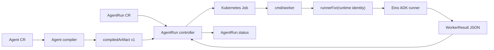

# Phase 2 Eino Runtime Design

Phase 2 replaces the structured placeholder worker with a real Eino-based
runtime while keeping the Kubernetes-native control-plane contract stable.

## Goals

- Execute the EHS hazard-identification Agent through a real Eino runner.
- Preserve the Phase 1 `AgentRun` contract:
  - `AgentRun.status.phase`
  - `AgentRun.status.output`
  - `AgentRun.status.traceRef`
  - `AgentRun.status.agentRevision`
- Preserve the worker result envelope so the controller can keep parsing one
  structured JSON document from worker logs.
- Keep `runtime.engine=eino` and `runtime.runnerClass=adk` as the default
  runtime identity.
- Introduce an Eino-compatible compiled artifact shape without forcing an
  immediate CRD version bump.
- Make the first real execution path small enough to validate in OrbStack.

## Non-Goals

- Do not build the full multi-agent fabric in Phase 2.
- Do not require all tools, MCP servers, knowledge bases, memory, and
  checkpointing to be fully implemented before the first real Eino execution.
- Do not replace the Kubernetes Job runtime backend yet.
- Do not change the public API group or resource names.
- Do not rewrite the already published `v0.1.0` tag.

## Current Contract

The Phase 1 worker receives:

- `AGENT_NAME`
- `AGENT_RUN_NAME`
- `AGENT_RUN_NAMESPACE`
- `AGENT_REVISION`
- `AGENT_COMPILED_ARTIFACT`

The worker emits one JSON document matching `internal/contract.WorkerResult`.
The controller parses this document from the worker Pod logs and writes a
summary to `AgentRun.status.output` plus Pod metadata to
`AgentRun.status.traceRef`.

This contract stays compatible in Phase 2. New fields can be added, but existing
fields must keep their meaning.

## Architecture



The Phase 1 `EinoADKPlaceholderRunner` remains useful as a fallback and as a
contract test fixture. The real runner should live behind the same
`internal/worker.Runner` interface.

## Eino Runner Layers

The first implementation should split the worker runtime into narrow layers:

| Layer | Responsibility |
| --- | --- |
| Runtime dispatch | Validate `runtime.engine` and `runtime.runnerClass`, then select the runner. |
| Artifact decoder | Decode the compiled artifact into typed Go structs. |
| Eino builder | Convert the typed artifact into an Eino ADK/Graph runtime. |
| Model provider | Construct model clients from artifact config and environment/secret references. |
| Prompt renderer | Resolve prompt templates and render runtime variables. |
| Execution adapter | Execute the EHS happy path and normalize output. |
| Result writer | Emit `WorkerResult` and preserve Phase 1 compatibility. |

The first production code change should add typed artifact decoding and tests
before importing the Eino SDK. That gives us a stable boundary for the SDK work.

## Compiled Artifact v1 Draft

The compiler already writes `Agent.status.compiledArtifact`. Phase 2 should keep
the top-level object compatible and add a `runner` block.

```json
{
  "apiVersion": "windosx.com/v1alpha1",
  "kind": "AgentCompiledArtifact",
  "schemaVersion": "v1",
  "agent": {
    "name": "ehs-hazard-identification-agent",
    "namespace": "ehs",
    "generation": 1
  },
  "runtime": {
    "engine": "eino",
    "runnerClass": "adk",
    "mode": "stateful",
    "entrypoint": "ehs.hazard_identification"
  },
  "runner": {
    "kind": "EinoADKRunner",
    "entrypoint": "ehs.hazard_identification",
    "graph": {
      "stateSchema": {},
      "nodes": [],
      "edges": []
    },
    "prompts": {
      "system": {
        "name": "ehs-hazard-identification-system",
        "language": "zh-CN",
        "template": "..."
      }
    },
    "models": {
      "planner": {
        "provider": "openai",
        "model": "gpt-4.1",
        "temperature": 0.1,
        "maxTokens": 4000,
        "timeoutSeconds": 60
      }
    },
    "output": {
      "schema": {}
    }
  },
  "policyRef": "ehs-default-safety-policy"
}
```

The compiler should continue to include the existing top-level fields during
the transition. The worker can prefer `runner` when present and fall back to the
Phase 1 shape while the migration is in progress.

## First EHS Happy Path

The first real execution should support a constrained path:

1. Read `AgentRun.spec.input`.
2. Load the compiled EHS system prompt from the artifact.
3. Select one configured model, initially the `planner` model.
4. Ask the model to produce JSON matching `Agent.spec.interfaces.output.schema`.
5. Parse the model response as JSON.
6. Write the parsed object into `WorkerResult.output` or a compatible extension
   of `AgentRun.status.output`.

The first path can ignore image analysis, HTTP tools, MCP, retrieval, and
checkpointing. It must clearly report skipped capabilities in the worker output
or trace metadata.

## Worker Result v1 Extension

Phase 1 worker result:

```json
{
  "status": "succeeded",
  "message": "agent control plane worker placeholder completed",
  "compiledArtifact": {
    "runtimeEngine": "eino",
    "runnerClass": "adk"
  }
}
```

Phase 2 can add optional fields:

```json
{
  "status": "succeeded",
  "message": "agent control plane worker completed",
  "output": {
    "summary": "...",
    "hazards": [],
    "overallRiskLevel": "medium",
    "nextActions": [],
    "confidence": 0.7,
    "needsHumanReview": true
  },
  "artifacts": [
    {
      "name": "model-response",
      "kind": "json",
      "inline": {}
    }
  ],
  "runtime": {
    "engine": "eino",
    "runnerClass": "adk",
    "runner": "EinoADKRunner"
  }
}
```

The controller should preserve Phase 1 summary fields and copy the new output
object into `AgentRun.status.output.result` or a similarly explicit field.

## Error Handling

The worker should distinguish:

- invalid artifact
- unsupported runtime identity
- missing required runtime configuration
- missing model credentials
- model call failure
- model output parse failure
- output schema validation failure
- context cancellation

All failures still emit a structured worker failure document when possible.

## Configuration and Secrets

Model credentials must not be embedded in the compiled artifact. The first
runner should load provider credentials from worker environment variables. A
later iteration can add Kubernetes Secret references and scoped runtime service
accounts.

Minimum first provider contract:

| Provider | Environment |
| --- | --- |
| OpenAI-compatible | `OPENAI_API_KEY`, optional `OPENAI_BASE_URL` |

## Test Plan

- Unit tests for typed artifact decoding.
- Unit tests for runtime dispatch to real Eino runner versus placeholder.
- Unit tests for prompt rendering and input mapping.
- Unit tests for model response parsing and schema failure.
- Controller/runtime tests that verify new worker output fields are preserved.
- OrbStack smoke test using the EHS sample and the worker Job backend.

## Implementation Slices

1. **Artifact contract**: add typed artifact structs under `internal/contract`
   or `internal/worker`, plus tests. Status: implemented under
   `internal/contract` as the typed `CompiledArtifact` decoder; worker dispatch
   now consumes this contract while preserving Phase 1 artifact compatibility.
2. **Compiler enrichment**: add `schemaVersion` and `runner` blocks while
   preserving the existing artifact fields. Status: implemented; the compiler
   now emits `schemaVersion: v1` and an `EinoADKRunner` block that can be
   decoded by the typed contract.
3. **Worker output extension**: add optional `output`, `artifacts`, and
   `runtime` fields to `WorkerResult`.
4. **Eino runner skeleton**: add a real runner type behind `Runner`, initially
   with injected interfaces and no external model call.
5. **SDK integration**: import Eino and build the first ChatModel/ADK execution
   path.
6. **EHS happy path**: execute text-only hazard identification and write
   structured output.
7. **OrbStack validation**: build images, deploy, invoke gateway, and confirm
   `AgentRun.status.output.result`.

## Open Questions

- Should the first real runner use Eino ADK directly, or compile the graph into
  Eino Graph/Workflow primitives first?
- Should output schema validation happen in the worker only, or also in the
  controller as a defensive check?
- Should `AgentRun.spec.execution.mode=sync` have any special meaning while the
  underlying execution is still Job-based?
- How should missing optional capabilities, such as tools and retrieval, be
  represented in output without looking like successful tool execution?

## References

- CloudWeGo Eino overview: https://www.cloudwego.io/docs/eino/overview/
- CloudWeGo Eino ADK: https://www.cloudwego.io/docs/eino/core_modules/eino_adk/
- CloudWeGo Eino Graph orchestration: https://www.cloudwego.io/docs/eino/core_modules/chain_and_graph_orchestration/
- CloudWeGo Eino components: https://www.cloudwego.io/docs/eino/core_modules/components/
